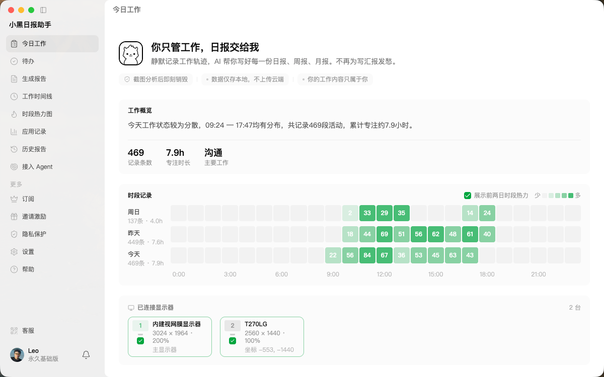
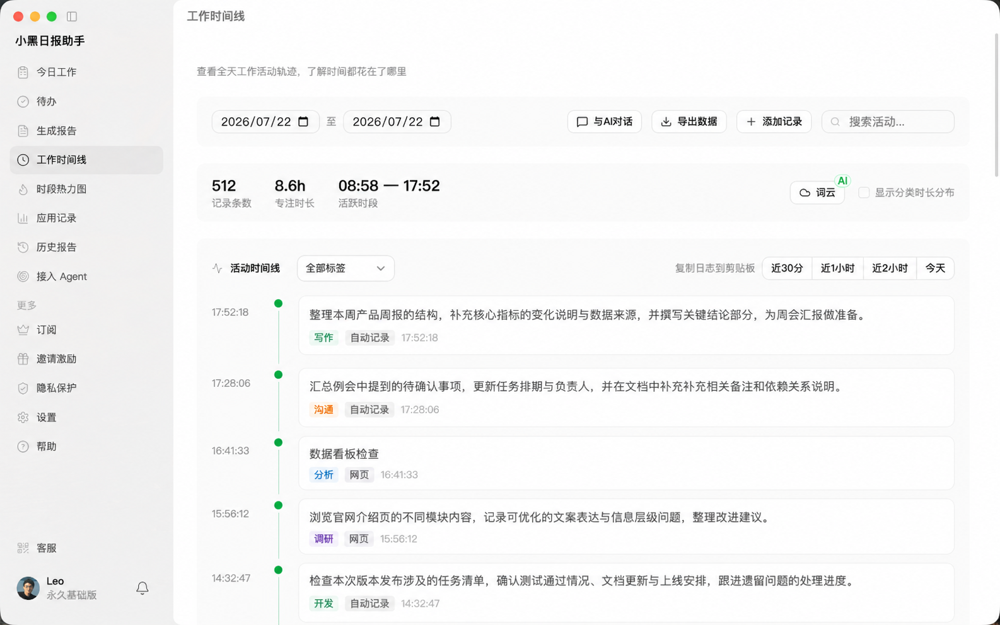
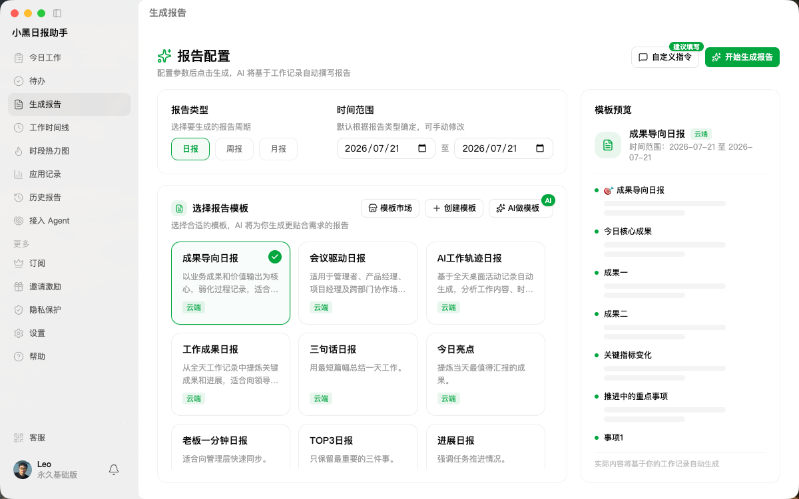
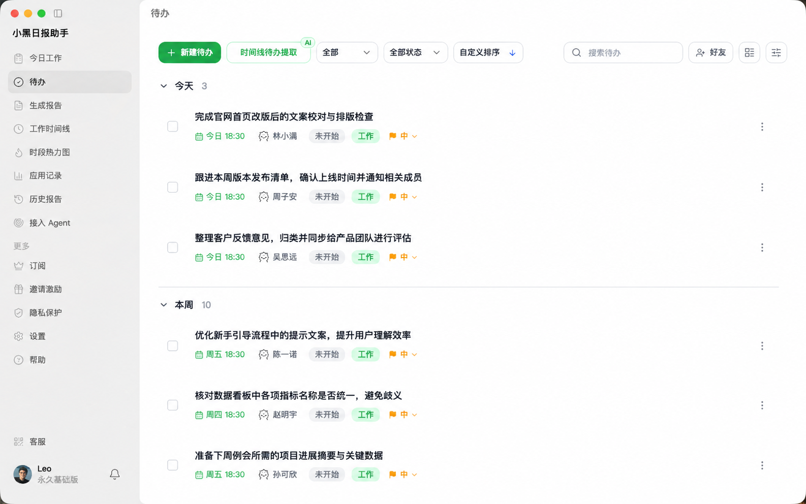
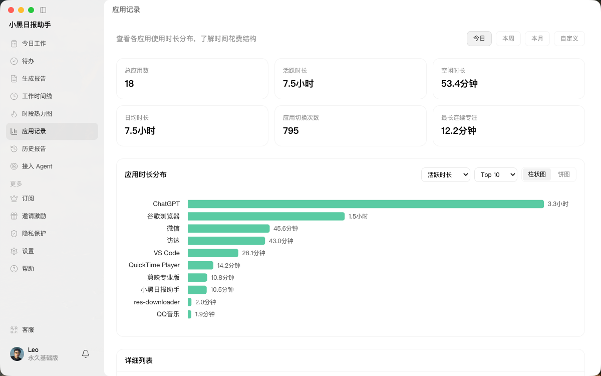
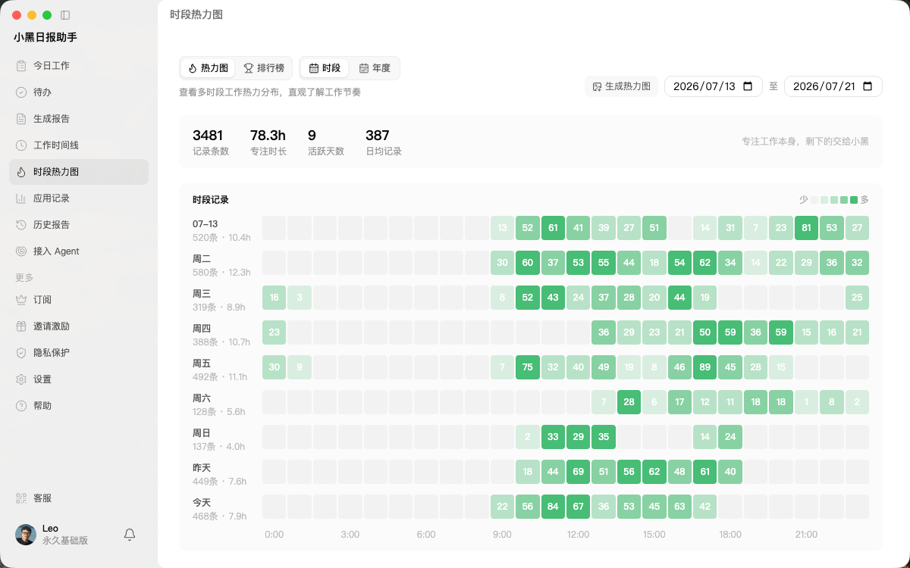
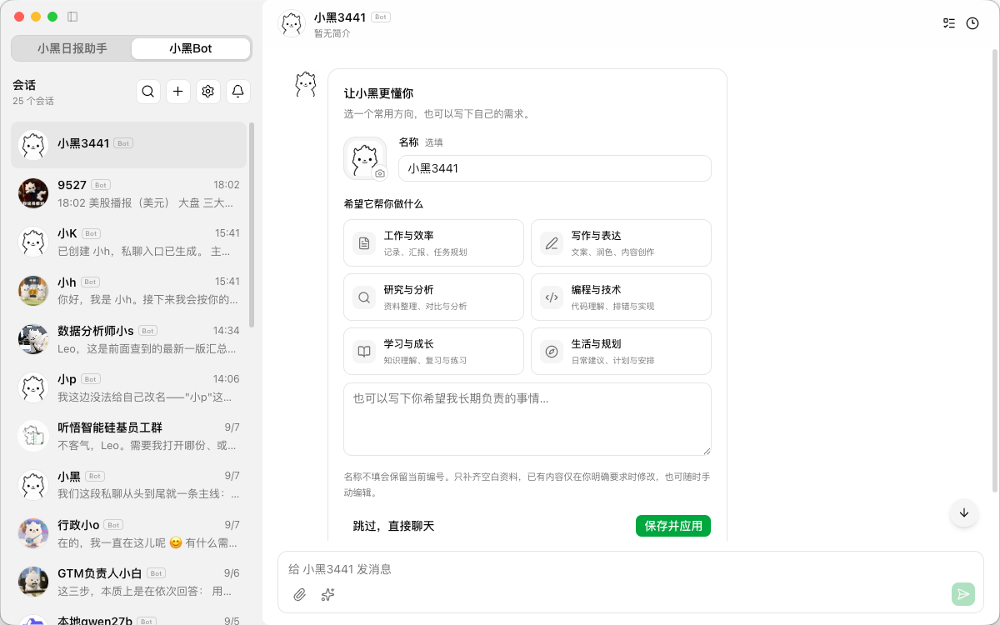
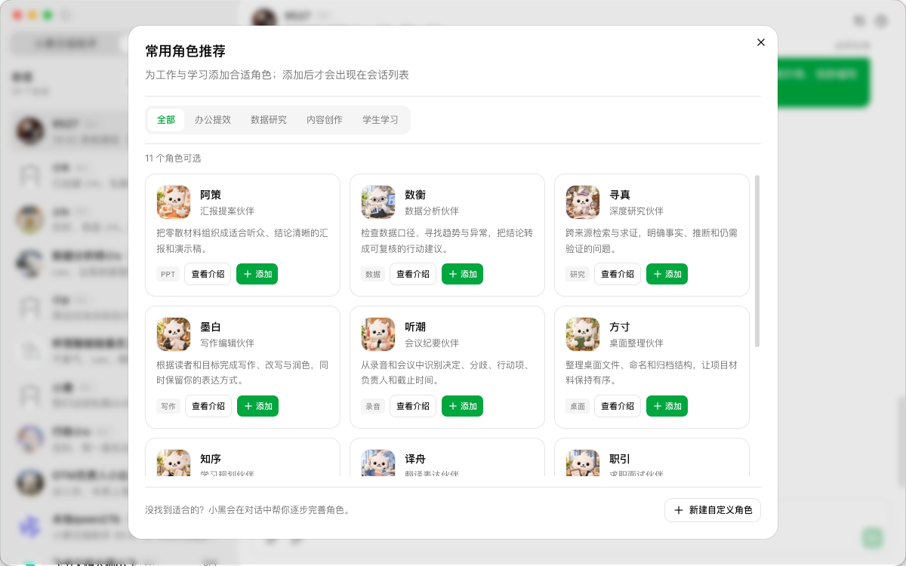

<div align="center">


# Xiaohei Daily Assistant · 小黑日报助手

**Your AI work memory and review assistant**

Understand what you worked on, turn it into useful reports, and plan what comes next.

[简体中文](README.md) · **English**

[Website](https://www.xiaoheiribao.com/) · [Latest release](https://github.com/shjiyue/xiaoheiribao/releases/latest) · [Xiaohei Bot](https://www.xiaoheiribao.com/bot/) · [User guide](https://www.xiaoheiribao.com/docs/) · [All releases](https://github.com/shjiyue/xiaoheiribao/releases)

</div>

---

Xiaohei Daily Assistant is an AI desktop work assistant for **Windows and macOS**. It connects activity recording, AI understanding, daily and weekly reports, tasks, and Xiaohei Bots, helping you turn scattered work activity into a factual history, usable reports, and follow-up actions.

**This repository provides product information, usage guidance, and download links. Every installer link points directly to a Release asset in the production distribution repository, [shjiyue/xiaoheiribao](https://github.com/shjiyue/xiaoheiribao/releases). Installers are not mirrored here.**

> Last verified: **September 16, 2026 (China Standard Time)**. The latest stable release is **v1.7.2**. Version-specific links remain pinned to that release; use the [latest release page](https://github.com/shjiyue/xiaoheiribao/releases/latest) for future updates. The official website still lists the WeChat Mini Program as coming soon.

## Contents

- [Download and install](#download)
- [What's new in v1.7.2](#updates)
- [Product features](#features)
- [Xiaohei Bot: your AI work partners](#bot)
- [Workflow and use cases](#workflow)
- [Screenshots](#screenshots)
- [Privacy, data, and permissions](#privacy)
- [Getting started](#getting-started)
- [Frequently asked questions](#faq)
- [Previous releases and additional assets](#history)
- [About the team and official resources](#about)

<a id="download"></a>

## Download and install

**Latest stable release: v1.7.2 · Published 2026-09-15 18:07 (China Standard Time / UTC+8)**

[Full release notes](https://github.com/shjiyue/xiaoheiribao/releases/tag/v1.7.2) · [Always check the latest release](https://github.com/shjiyue/xiaoheiribao/releases/latest)

### Recommended installers

Choose one installer for your operating system and Mac chip. Sizes are rounded to one decimal place in MiB (1 MiB = 1,048,576 bytes).

| Platform | Download | Size |
| --- | --- | --- |
| Windows | [XiaoheiDailyAssistant-Setup-1.7.2.exe](https://github.com/shjiyue/xiaoheiribao/releases/download/v1.7.2/XiaoheiDailyAssistant-Setup-1.7.2.exe) | 165.1 MiB |
| macOS · Apple silicon (M series) | [XiaoheiDailyAssistant-1.7.2-mac-arm64.dmg](https://github.com/shjiyue/xiaoheiribao/releases/download/v1.7.2/XiaoheiDailyAssistant-1.7.2-mac-arm64.dmg) | 297.1 MiB |
| macOS · Intel | [XiaoheiDailyAssistant-1.7.2-mac-x64.dmg](https://github.com/shjiyue/xiaoheiribao/releases/download/v1.7.2/XiaoheiDailyAssistant-1.7.2-mac-x64.dmg) | 305.0 MiB |

- **Windows:** Download the `.exe`, run it, and follow the installer.
- **Mac with Apple silicon:** Choose `mac-arm64.dmg` for a Mac that lists an Apple M-series chip in About This Mac.
- **Mac with Intel:** Choose `mac-x64.dmg` for a Mac that lists an Intel processor.
- **Find your Mac chip:** Open the  Apple menu → About This Mac → check Chip or Processor. Open the matching DMG and follow the installation window.

### ZIP-wrapped installers

Use these assets if you prefer a compressed download. **Extract the ZIP first, then run the enclosed `.exe` or open the `.dmg`.**

| Platform | Download | Size |
| --- | --- | --- |
| Windows | [XiaoheiDailyAssistant-Setup-1.7.2.exe.zip](https://github.com/shjiyue/xiaoheiribao/releases/download/v1.7.2/XiaoheiDailyAssistant-Setup-1.7.2.exe.zip) | 164.8 MiB |
| macOS · Apple silicon (M series) | [XiaoheiDailyAssistant-1.7.2-mac-arm64.dmg.zip](https://github.com/shjiyue/xiaoheiribao/releases/download/v1.7.2/XiaoheiDailyAssistant-1.7.2-mac-arm64.dmg.zip) | 296.3 MiB |
| macOS · Intel | [XiaoheiDailyAssistant-1.7.2-mac-x64.dmg.zip](https://github.com/shjiyue/xiaoheiribao/releases/download/v1.7.2/XiaoheiDailyAssistant-1.7.2-mac-x64.dmg.zip) | 304.2 MiB |

### Verify download integrity

- Original installers and related assets: [SHA256SUMS.txt](https://github.com/shjiyue/xiaoheiribao/releases/download/v1.7.2/SHA256SUMS.txt).
- The three ZIP-wrapped installers above: [INSTALLER-ZIP-SHA256SUMS.txt](https://github.com/shjiyue/xiaoheiribao/releases/download/v1.7.2/INSTALLER-ZIP-SHA256SUMS.txt).

<details>
<summary>Show SHA-256 hashes and verification commands</summary>

These values come from the release's GitHub asset metadata.

| File | SHA-256 |
| --- | --- |
| `XiaoheiDailyAssistant-Setup-1.7.2.exe` | `6a8dd72d264f703fbcc31686073e924b09c60a461795aba59cbb3be1aca30ec6` |
| `XiaoheiDailyAssistant-1.7.2-mac-arm64.dmg` | `fc4c57b0b35bd06621ee4527048e3a393887f4b4b51d354c3e9719afd4e5c418` |
| `XiaoheiDailyAssistant-1.7.2-mac-x64.dmg` | `8b442e2af6148cc6ace35db5f70e5e035cee5e53cac4176e814b783827426835` |

Windows PowerShell, from your download directory:

```powershell
Get-FileHash .\XiaoheiDailyAssistant-Setup-1.7.2.exe -Algorithm SHA256
```

macOS, from your download directory (Apple silicon example):

```bash
shasum -a 256 XiaoheiDailyAssistant-1.7.2-mac-arm64.dmg
```

Compare the output with the table or the appropriate checksum file. For ZIP-wrapped installers, use the ZIP checksum list.

</details>

<a id="updates"></a>

## What's new in v1.7.2

The following notes are reproduced from the production repository's [v1.7.2 release](https://github.com/shjiyue/xiaoheiribao/releases/tag/v1.7.2).

- **Updates Start with Your Confirmation:** New versions show a reminder first. Downloading and installation start after you click Update Now. If an update fails, the app explains the error and waits for you to download again, reducing repeated downloads and data usage.
- **Shared Bot Workspace:** Choose a shared folder in Bot Settings so Bots under the same account can work with common materials. Edit shared instructions and view previous versions while keeping private conversations and memories separate.
- **Smoother Long Conversations:** Improved long chats and continuation of older conversations. Message history is preserved, and Bots can look up earlier content from the current conversation when needed.
- **Clearer Bot Roles and Replies:** Refined avatar animations and reply status indicators, and fixed issues with duplicate default roles and unintended changes to existing roles.
- **Website Recording Exclusions:** Exclude an entire website or specific pages from recording, with exceptions for pages you still want to record. Normal recording resumes when you switch to another page or app.
- **Easier Recording Setup:** Improved the first-time welcome and recording preference guide, with clearer recording controls, account switching, and pause explanations.
- **More Reliable Models and Screenshot Recognition:** Improved preservation of older model settings and switching between models, along with better DeepSeek screenshot recognition compatibility and error handling.
- **Smoother Report Viewing:** Open report history automatically when generation finishes, including reports created through chat, with clearer progress and completion messages.
- **Easier Task Collaboration:** Add private nicknames for friends, find recent contacts more easily, and use improved task search to work with the right people.
- **Xiaohei Growth Companions:** Access the growth plan and introductory tutorial from the recording page. See Xiaohei companions in chats, reports, the timeline, tasks, and statistics, with clearer growth reward details.
- Additional fixes and improvements.

<a id="features"></a>

## Product features

### Automatic recording and AI understanding

Xiaohei records screen and application activity while you work, then uses the selected AI service to recognize content, produce summaries, and categorize work. Screenshots, text, clipboard content, images, audio, and video can contribute to your work history. You can also add meetings, conversations, and other work that happened away from the screen.

- Configure recording intervals, selected monitors, and idle pause rules.
- Skip unchanged screens to reduce repetitive records.
- Exclude sensitive applications; v1.7.2 adds website and page exclusions with exceptions for pages you still want to record.
- Add your role, organization, projects, responsibilities, and frequent collaborators in your profile to help AI understand the context.

### Daily, weekly, monthly, and visual reports

Generate reports from your actual timeline for a day, week, month, or custom date range. Use templates from the template marketplace, create your own, add specific requirements, or continue working through supported web AI conversations.

Save reports to history, edit, copy, or export them, including HTML visual reports. Correct source records before generation, then check facts, project names, figures, and completion status before sharing the result.

### Work timeline and productivity insights

The timeline brings together automatic recognition, text entries, images, audio transcriptions, imports, and records written by Agents. Review, filter, edit, delete, or export your work history.

Application statistics, active and idle time, focus periods, application switching, hourly and daily trends, heatmaps, category breakdowns, and word clouds help you understand where time went and find evidence for reviews.

### Tasks and collaboration

Extract follow-up actions from work records and use later activity to help assess completion. Tasks support list, board, and Gantt views, with status, priority, dates, projects, descriptions, subtasks, progress, attachments, assignees, and followers. Recurring rules and a floating desktop task view are also available.

Version 1.7.2 adds private nicknames for friends and improves recent contacts and task search, making collaborators easier to find.

### Open APIs and local Agents

The website's **Lobster local service / Connect Agent** feature lets authorized external Agents query today's work, timeline records, historical reports, application statistics, heatmaps, and profile information. Supported interfaces can also expose task capabilities or let an Agent add work records.

You control the service's access scope. For configuration, authentication, and supported capabilities, see the [core features guide](https://www.xiaoheiribao.com/docs/manual/chapter-3) and [Agent and tool interface documentation](https://www.xiaoheiribao.com/docs/manual/chapter-11).

### Toolbox

The official guide also describes desktop tools for AI image and video generation, voice cloning and speech synthesis, Markdown reading and editing, a whiteboard, local image and PDF compression, milestones, and preparation for publishing videos across multiple platforms.

Local image compression, PDF compression, and milestones do not consume credits. AI generation features may charge according to the price or credits shown in the app. Publishing preparation can help upload material and fill in information; the user confirms the final publication.

### WeChat Mini Program — coming soon

The planned Mini Program will provide access to timelines, reports, application statistics, heatmaps, record search, tasks, and sharing. **As of this README's verification date, the website still labels it coming soon. It is not presented here as an available mobile app download.**

<a id="bot"></a>

## Xiaohei Bot: your AI work partners

Xiaohei Bot connects work history, documents, conversations, tools, and tasks. Describe a role in a sentence or add a suggested assistant, then give writing, research, programming, and everyday work to partners with different specialties.

| Capability | What you can do |
| --- | --- |
| Query real work | Look up timelines, previous reports, and application statistics in chat to review a project or date range. |
| Generate reports | Create daily, weekly, or monthly reports from work records and explicitly ask to save them to report history. |
| Manage tasks and records | Create, modify, and complete tasks in natural language, or explicitly add work to the timeline. |
| Collaborate across Bots | Add specialized Bots to a group and address them with `@`. You can also authorize Bots to create assistants, form teams, delegate tasks, or consult other Bots. |
| Work with images and files | Send images and documents for analysis. With Full Access enabled, Bots can read and write local files and run commands within their permissions. |
| Keep individual memories | Each Bot keeps its own important facts and preferences for later direct and group conversations. View, edit, or delete memory entries. |
| Schedule recurring work | Set one-time, daily, weekly, monthly, or interval tasks in direct chat and review execution history. The computer must be online and the desktop app must remain running. |
| Choose models and permissions | Configure default cloud or custom models, working directories, and access permissions for the task, including Chat Only or Full Access. |
| Share a workspace in v1.7.2 | Bots under the same account can use a shared folder and shared instructions with version history, while retaining their separate private chats and memories. |

Example requests:

> Use this week's work records to draft a project-based weekly report with achievements, issues, and next week's plan. Show me the draft first, then suggest follow-up tasks.

> Remember that my weekly reports should be grouped by project, with achievements before next steps.

> Every Friday at 18:00, summarize my week and return the result to this conversation.

Learn more: [Xiaohei Bot product page](https://www.xiaoheiribao.com/bot/) · [Xiaohei Bot guide](https://www.xiaoheiribao.com/docs/manual/chapter-4).

<a id="workflow"></a>

## Workflow and use cases

**Record → Understand and organize → Review and report → Act on the next steps**

1. **Record:** Collect screen and application activity alongside text, images, audio, and video you add yourself.
2. **Understand and organize:** AI uses your work context, profile, and categories to build a timeline you can review.
3. **Review and report:** Summarize outcomes for a selected period and template as daily, weekly, monthly, or visual reports.
4. **Follow through:** Extract tasks, assign collaboration, and keep track of progress using later work records.

| Scenario | How Xiaohei helps |
| --- | --- |
| End-of-day reporting | Generate a daily report from the timeline instead of reconstructing the day from memory. |
| Weekly review | Combine timelines, application statistics, heatmaps, and categories to review outcomes, effort, and problems. |
| Task management during work | Turn recorded action items into tasks with assignees, deadlines, subtasks, and attachments. |
| Writing, research, and programming | Give documents and goals to specialized Bots, using files and tools within their permissions. |
| Repetitive work | Schedule routine preparation while the desktop app remains running. |
| Existing Agent workflows | Let trusted local Agents query work memory, add explicitly requested records, or use enabled capabilities. |

<a id="screenshots"></a>

## Screenshots

These screenshots come from the official website and are stored in this repository. Interfaces may vary by installed version.



<details>
<summary>Show timeline, reports, tasks, statistics, and Bot screens</summary>

### Work timeline



### Report generation



### Task management



### Application activity



### Heatmap



### Xiaohei Bot





</details>

<a id="privacy"></a>

## Privacy, data, and permissions

Xiaohei follows a **local-first** data approach. Work timelines and reports are stored in a local database by default, with export, backup, restore, and cleanup options. Bot conversations and permission settings are also primarily stored locally.

- **Control recording scope:** Pause recording, exclude applications or websites, choose monitors, and disable detailed context collection.
- **Control original screenshots:** The website states that screenshots are deleted after analysis by default. If you enable retention, manage the storage location and cleanup schedule.
- **Choose the AI service:** Supported features can use default cloud models, custom endpoints, local models, or web accounts. **When using a cloud model, the necessary screenshots or text context are sent to the chosen service for processing. Local-first storage does not mean all AI processing is offline.**
- **Choose synchronization:** Enable report synchronization when needed. Mini Program synchronization is still listed as coming soon.
- **Set Bot permissions:** Choose Chat Only or Full Access according to the task, and manage working directories, file access, and tool use.
- **Control Agent connections:** Decide whether to enable the local service or LAN access, and manage authentication and request logs.

See the [policies and usage guide](https://www.xiaoheiribao.com/docs/manual/chapter-8) and [user agreement](https://www.xiaoheiribao.com/legal/user-agreement.html) for details.

<a id="getting-started"></a>

## Getting started

1. **Download and install:** Choose the installer matching your operating system and chip.
2. **Complete setup:** Follow the app to sign in, choose a model, and grant required system permissions. Automatic screen recording needs the relevant screen recording or recognition permission; configure other permissions for the features you enable.
3. **Set recording scope:** Configure intervals, monitors, excluded applications and websites, and idle pause rules before starting recording.
4. **Check your records:** After working for a while, review Today's Work and the Work Timeline to confirm records, summaries, and categories.
5. **Create your first report:** Select a date range, template, language, and model. Check the result, then save, copy, or export it.
6. **Create a Bot:** Choose a role and describe the task and expected output. Configure a shared workspace in Bot Settings if your Bots need common materials.

Tutorials: [Quick start](https://www.xiaoheiribao.com/docs/manual/chapter-2) · [Core features](https://www.xiaoheiribao.com/docs/manual/chapter-3) · [Practical tutorials](https://www.xiaoheiribao.com/docs/manual/chapter-5).

<a id="faq"></a>

## Frequently asked questions

### Which downloaded file should I open?

Open `.exe` on Windows or the matching `.dmg` on macOS. Extract `.exe.zip` or `.dmg.zip` first. GitHub's automatically generated `Source code` archives are not desktop installers. You do not need to manually install `.yml` or `.blockmap` files.

### How do I update?

Version 1.7.2 shows an update reminder first; downloading and installation begin after you click Update Now. If an update fails, the app explains the reason and stops until you manually download again. You can also get the appropriate installer from the [latest production release](https://github.com/shjiyue/xiaoheiribao/releases/latest).

### What if GitHub downloads are slow?

Check the [official website's download section](https://www.xiaoheiribao.com/#download) for currently available alternatives. Every specific installer link in this README points directly to a GitHub Release asset in `shjiyue/xiaoheiribao`.

### Is everything free?

The application is free to download and try. Subscription benefits, model allowances, and credit rules are shown in the app. AI models, image, video, and voice features may use credits or incur fees from the selected service. See the [purchase guide](https://www.xiaoheiribao.com/docs/manual/chapter-6).

### Will scheduled Bot tasks run after I turn off my computer?

The website states that the computer must be online and the desktop app must remain running. Keep the device available when scheduled work is due.

### Why are there no new work records?

Check the recording switch, system permissions, idle state, exclusions, monitor selection, and the chosen model's network and credit availability. See [troubleshooting](https://www.xiaoheiribao.com/docs/manual/chapter-7).

<a id="history"></a>

## Previous releases and additional assets

### v1.7.1

The production repository also retains **v1.7.1, published September 15, 2026**. Prefer v1.7.2 for a new installation; use the original assets below when you specifically need the older version.

| Platform | Download | Size |
| --- | --- | --- |
| Windows | [XiaoheiDailyAssistant-Setup-1.7.1.exe.zip](https://github.com/shjiyue/xiaoheiribao/releases/download/v1.7.1/XiaoheiDailyAssistant-Setup-1.7.1.exe.zip) | 163.4 MiB |
| macOS · Apple silicon (M series) | [XiaoheiDailyAssistant-1.7.1-mac-arm64.dmg.zip](https://github.com/shjiyue/xiaoheiribao/releases/download/v1.7.1/XiaoheiDailyAssistant-1.7.1-mac-arm64.dmg.zip) | 267.7 MiB |
| macOS · Intel | [XiaoheiDailyAssistant-1.7.1-mac-x64.dmg.zip](https://github.com/shjiyue/xiaoheiribao/releases/download/v1.7.1/XiaoheiDailyAssistant-1.7.1-mac-x64.dmg.zip) | 275.7 MiB |

[v1.7.1 release page](https://github.com/shjiyue/xiaoheiribao/releases/tag/v1.7.1) · [v1.7.1 ZIP checksums](https://github.com/shjiyue/xiaoheiribao/releases/download/v1.7.1/SHA256SUMS.txt) · [All release history](https://github.com/shjiyue/xiaoheiribao/releases)

### Additional v1.7.2 assets

The release also provides these macOS ZIP assets for users who need that distribution format. Prefer the DMG installers above for a standard installation.

| Platform | Download | Size |
| --- | --- | --- |
| macOS · Apple silicon | [XiaoheiDailyAssistant-1.7.2-mac-arm64.zip](https://github.com/shjiyue/xiaoheiribao/releases/download/v1.7.2/XiaoheiDailyAssistant-1.7.2-mac-arm64.zip) | 284.8 MiB |
| macOS · Intel | [XiaoheiDailyAssistant-1.7.2-mac-x64.zip](https://github.com/shjiyue/xiaoheiribao/releases/download/v1.7.2/XiaoheiDailyAssistant-1.7.2-mac-x64.zip) | 292.7 MiB |

Update metadata includes [latest.yml](https://github.com/shjiyue/xiaoheiribao/releases/download/v1.7.2/latest.yml), [latest-mac.yml](https://github.com/shjiyue/xiaoheiribao/releases/download/v1.7.2/latest-mac.yml), [latest-mac-x64.yml](https://github.com/shjiyue/xiaoheiribao/releases/download/v1.7.2/latest-mac-x64.yml), and the corresponding `.blockmap` files. These support the client's update process; regular users do not need to download them individually.

<a id="about"></a>

## About the team and official resources

**Help every workday become a record you can understand and build on.**

According to the official website, 上海听悟智能科技有限公司 (Shanghai Tingwu Intelligent Technology Co., Ltd.) is a wholly owned subsidiary of 上海暨岳信息技术有限公司 (Shanghai Jiyue Information Technology Co., Ltd.). Founded in 2023, the company focuses on AI application products. Since 2026, its work has centered on Xiaohei Daily Assistant, helping people preserve work outcomes, review progress, prepare reports, and follow through on important tasks.

| Team member | Responsibilities |
| --- | --- |
| Leo | Founder; product, architecture, and growth |
| Miranda | Product manager; AI products and user experience |
| Ariza | Core developer; full-stack development and architecture implementation |
| Wayne | Core developer; desktop application development |

The website displays an [electronic copyright certificate](assets/images/software-copyright-certificate.jpg) and a [software copyright certificate](assets/images/software-copyright-blockchain.jpg).

| Resource | Link |
| --- | --- |
| Website | [www.xiaoheiribao.com](https://www.xiaoheiribao.com/) |
| Xiaohei Bot | [Product page](https://www.xiaoheiribao.com/bot/) |
| User manual | [Complete guide](https://www.xiaoheiribao.com/docs/) |
| Product white paper | [Feishu white paper](https://mcnhmlyyd69x.feishu.cn/wiki/N55CwztFlif60pknkkecEdM6n6e?from=from_copylink) |
| Blog | [Product updates and articles](https://www.xiaoheiribao.com/blog.php) |
| Xiaohei Ambassador | [Official program page](https://www.xiaoheiribao.com/ambassador/) |
| Installers and updates | [Production release repository](https://github.com/shjiyue/xiaoheiribao/releases) |
| Contact and feedback | Use Contact Us on the [website](https://www.xiaoheiribao.com/) or the support entry in the app. |

This README is based on the official homepage, Xiaohei Bot page, and user manual. Version details and installer links were checked against the production repository's public Releases. Features, service benefits, and releases may change; refer to the website, app, and relevant release notes for current details. Official guides linked here are primarily in Chinese.
